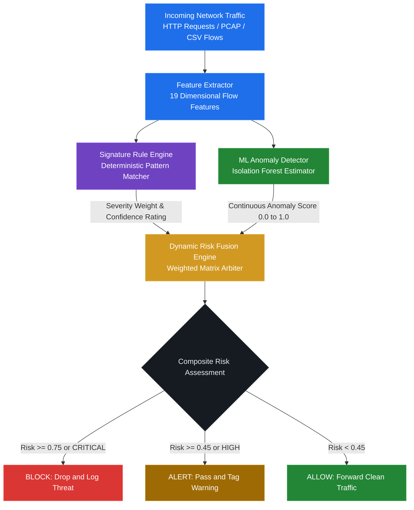

<div align="center">

# Hybrid-WAF

### Next-Generation Hybrid Web Application Firewall & Network Intrusion Detection System

A dual-engine cybersecurity defense platform integrating deterministic signature matching, unsupervised machine learning anomaly detection, and a dynamic risk fusion arbiter for real-time traffic filtering and threat mitigation.

<br />

<p align="center">
  
  
  
  
  
  
  
  
</p>

<p align="center">
  
  
  
  
  
  
</p>

<br />

<p align="center">
  <a href="#overview">Overview</a> |
  <a href="#system-architecture">System Architecture</a> |
  <a href="#core-detection-pipeline">Core Pipeline</a> |
  <a href="#interactive-streamlit-web-dashboard">Dashboard</a> |
  <a href="#branch-innovations-ambar-gairola-branches">Branch Innovations</a> |
  <a href="#installation-and-setup">Installation</a> |
  <a href="#execution-guide">Execution Guide</a>
</p>

</div>

---

## Executive Summary

```
==================================================================================================
  LAYER 1: SIGNATURE ENGINE     -->  Deterministic YAML Pattern Matching (Known Threat Exploits)
  LAYER 2: ISOLATION FOREST ML  -->  Unsupervised Anomaly Modeling (Zero-Days & Behavioral Drift)
  LAYER 3: DYNAMIC RISK FUSION  -->  Confidence-Weighted Decision Matrix (ALLOW / ALERT / BLOCK)
==================================================================================================
```

Traditional signature-only Web Application Firewalls (WAFs) fail against novel evasion techniques and parameter permutations, while standalone machine learning systems frequently produce high false-positive rates on benign operational shifts.

Hybrid-WAF bridges this gap through a synchronized multi-tiered defense architecture:

| Tier | Security Engine | Detection Approach | Key Strength |
|:---:|:---:|:---:|:---:|
| **Layer 1** | **Signature Rule Engine** | Declarative YAML condition matching | Sub-millisecond identification of known attacks (SQLi, XSS, Probes) |
| **Layer 2** | **ML Anomaly Detector** | Unsupervised Isolation Forest | Catches subtle behavioral outliers and novel zero-day attack patterns |
| **Layer 3** | **Dynamic Risk Fusion** | Confidence-weighted multi-factor scoring | Arbitrates conflicts, eliminates false alarms, and issues authoritative actions |

---

## System Architecture

### Architectural Flowchart



### Flow Representation

```
                              INCOMING TRAFFIC STREAM
              [ HTTP Requests | Network PCAP Packets | CSV Ingestion ]
                                         |
                                         v
                         +-------------------------------+
                         |   Feature Extraction Engine   |
                         |  (19 Network Flow Attributes) |
                         +---------------+---------------+
                                         |
                    +--------------------+--------------------+
                    |                                         |
                    v                                         v
     +-----------------------------+           +-----------------------------+
     |     Signature Rule Engine   |           |    ML Anomaly Detector      |
     |   (Declarative YAML Rules)  |           |     (Isolation Forest)      |
     +--------------+--------------+           +--------------+--------------+
                    |                                         |
         Severity & Confidence                         Anomaly Score
              (0.0 - 1.0)                                (0.0 - 1.0)
                    |                                         |
                    +--------------------+--------------------+
                                         |
                                         v
                         +-------------------------------+
                         |   Dynamic Risk Fusion Engine  |
                         |  Weighted Scoring & Threshold |
                         +---------------+---------------+
                                         |
                      +------------------+------------------+
                      |                  |                  |
                      v                  v                  v
                  [ ALLOW ]          [ ALERT ]          [ BLOCK ]
```

---

## Core Detection Pipeline

### 1. Feature Extractor
*Module: `engine/feature_extractor.py`*

Converts unstructured packet flows and tabular records into 19 normalized statistical metrics aligned with standard intrusion benchmarks (CIC-IDS2017):

- **Temporal Metrics**: `flow_duration`, `flow_iat_mean`, `flow_iat_std`, `flow_iat_max`, `fwd_iat_total`
- **Volume Metrics**: `total_fwd_packets`, `total_bwd_packets`, `total_len_fwd_packets`, `total_len_bwd_packets`
- **Payload Statistics**: `fwd_packet_length_max`, `fwd_packet_length_min`, `fwd_packet_length_mean`, `bwd_packet_length_mean`
- **Protocol & Flag Counters**: `fwd_header_length`, `bwd_header_length`, `fwd_packets_s`, `bwd_packets_s`, `syn_flag_count`, `ack_flag_count`

Maintains internal distribution statistics (mean and variance) to project numeric metrics into standardized feature arrays for machine learning ingestion.

### 2. Signature Rule Engine
*Module: `engine/rule_engine.py` | Configuration: `config/rules.yaml`*

Performs high-throughput deterministic signature evaluation across payloads, headers, ports, and flow metrics. Supports structured logical expressions:

- **Comparison Operators**: `>`, `<`, `>=`, `<=`, `==`, `!=`
- **Text & Payload Operators**: `contains`, `startswith`, `endswith`, `in`

Produces a strongly-typed `RuleEngineOutput` payload containing:
- `rule_detected`: Boolean flag indicating match presence.
- `matched_rules`: Detailed list of triggered rules with IDs, severities, confidence metrics, and fired patterns.
- `highest_severity`: Escalated severity tier (`LOW`, `MEDIUM`, `HIGH`, `CRITICAL`).
- `max_confidence`: Highest confidence score across all matching rules.

### 3. Machine Learning Anomaly Detector
*Module: `engine/ml_detector.py`*

Implements an unsupervised **Isolation Forest** (`sklearn.ensemble.IsolationForest`) model:
- **Baseline Training**: Trained exclusively on validated benign/normal network flows, learning high-dimensional structural representations of clean traffic.
- **Continuous Scoring**: Produces calibrated anomaly probabilities bounded between `0.0` (nominal) and `1.0` (severe anomaly).
- **Dynamic Dimensional Alignment**: Features an automatic vector alignment subsystem that handles schema variations by padding missing dimensions or slicing excesses, preserving backward compatibility.
- **Calibrated Thresholding**: Configurable decision boundary (default `0.55`) for anomaly discrimination.

### 4. Dynamic Risk Fusion Engine
*Module: `engine/fusion.py`*

Arbiter module combining deterministic certainty with unsupervised anomaly scores into a unified threat index.

#### Risk Formula

```
Composite Risk = (w_rule * Rule Contribution) + (w_ml * ML Contribution)

Where:
  Rule Contribution = Severity Weight * Rule Max Confidence
  ML Contribution   = ML Anomaly Score
  Default Weights   = w_rule: 0.60  |  w_ml: 0.40
```

#### Severity Scaling Matrix

| Severity Level | Base Weight | Threshold Priority |
|---|:---:|---|
| **CRITICAL** | `1.00` | Immediate override to BLOCK regardless of ML score |
| **HIGH** | `0.85` | Immediate override to ALERT or BLOCK |
| **MEDIUM** | `0.50` | Proportional contribution to composite risk |
| **LOW** | `0.25` | Minor contribution to composite risk |
| **NONE** | `0.00` | Zero contribution (pure ML anomaly evaluation) |

#### Decision Action Boundaries

```
[0.00 ------------------- 0.45 ------------------- 0.75 ------------------- 1.00]
         ALLOW                      ALERT                      BLOCK
   (Normal Traffic)          (Suspicious Activity)      (Confirmed Threat)
```

- **BLOCK** (`Risk >= 0.75` or `Severity == CRITICAL`): Connection dropped, request denied, audit alert generated.
- **ALERT** (`Risk >= 0.45` or `Severity == HIGH`): Request permitted with security flags, recorded in forensic stream.
- **ALLOW** (`Risk < 0.45`): Clean traffic routed without interruption.

---

## Interactive Streamlit Web Dashboard

The web interface (`ui/dashboard.py`) provides an operations center with specialized views:

### 1. Dashboard Overview
- Executive summary metrics: Total Flows Analyzed, Blocks Enforced, Warnings Issued, Allowed Requests.
- Visual telemetry: Action breakdown distribution, attack category distribution, and risk score histograms.
- Engine status monitors: Isolation Forest model state, anomaly threshold index, and active signature count.

### 2. Analyze Traffic
- Ingestion of network flow CSV records and CIC-IDS2017 dataset slices.
- Batch processing across thousands of connection flows.
- Interactive data grid with color-coded decision badges, triggered rules, and anomaly scores.
- Forensic search and filtering by action, severity, IP addresses, and rule names.

### 3. Train Model
- Complete in-browser model lifecycle management.
- Dynamic data source selection (custom uploaded datasets or generated traffic).
- Automatic filtering for benign flows to safeguard against training data poisoning.
- Hyperparameter tuning: Contamination factor (0.01 - 0.20) and Estimator count (50 - 300).
- Immediate export to `models/isolation_forest.pkl`.

### 4. Rules Viewer
- Live catalog of all signature definitions loaded from `config/rules.yaml`.
- Search across rule IDs, patterns, attack categories, and condition statements.
- Granular severity inspection with confidence metrics.

---

## Branch Innovations (Ambar Gairola Branches)

The branches authored and updated by **Ambar Gairola** (`test-branch` and `test-branch-2`) introduce real-time simulation, attack traffic generation, and model explainability:

### 1. Safe Localhost Traffic Generator
*Module: `traffic_generator.py`*

A sandboxed, ethical traffic synthesis engine designed for safe pipeline validation:
- **Sandbox Boundary Enforcement**: Strictly validates destinations against `127.0.0.1` and `localhost`. Any attempt to target external IPs or domains raises an immediate assertion error.
- **Attack Synthesis Profiles**:
  - `generate_payload_http`: Injects SQLi (`' OR 1=1`, `admin'--`, `UNION SELECT`) and XSS (`<script>`, `onerror=`, `javascript:`) vectors.
  - `generate_path_fuzz_http`: Traversal and reconnaissance scans targeting `../`, `/.env`, `/wp-admin`, and administrative interfaces.
  - `generate_login_burst_http`: Rapid authentication attempts modeling credential stuffing.
  - `generate_port_probe`: TCP socket probing across sequential localhost ports.
  - `generate_connection_burst`: Concurrent TCP socket connect/close floods to simulate DoS pressure.
  - `generate_weighted_mixed_traffic`: Realistic multi-vector simulations with customizable percentages of Normal, Suspicious, and Malicious events.

### 2. Real-Time WAF Simulation and Stream Replay
*Module: `ui/dashboard.py` (`test-branch-2`)*

- **Stream Mode**: Interactive request-by-request replay with adjustable streaming delay (0.0s to 0.25s).
- **Dynamic Counters**: Real-time counter metrics tracking Allowed, Alerted, and Blocked events live.
- **Rule Explainability Panel**: Inspects matched rules, triggered regex/substring patterns, match location (URI, headers, payload), and severity levels.
- **ML Anomaly Score Tracker**: Real-time time-series plot comparing anomaly scores against the threshold boundary.
- **Scenario History & Replay**: Session-persisted run history allowing instant re-execution of prior simulation batches.

### 3. Automated Evaluation Framework
*Module: `engine/evaluation.py`*

Quantitative model validation suite calculating enterprise performance metrics:
- Accuracy, Precision, Recall, and False Positive totals.
- Detection Rate breakdown by individual attack classification (SQLi, XSS, Recon, DoS).

### 4. Traffic Capture & Packet Sniffing
*Module: `capture/traffic_capture.py`*

- Serializes synthetic localhost traffic into structured event logs (`capture/generated_traffic.csv`).
- Optional live packet sniffing powered by Scapy (`scapy.all.sniff`), extracting raw IP/TCP/UDP packet headers when loopback capture drivers (Npcap) are present.

### 5. Tabular Preprocessing & Normalization
*Module: `engine/preprocessing.py`*

- Automated type coercion and missing value imputation.
- Time-delta derivation (`epoch_seconds`, `hour`, `minute`, `time_since_start`).
- Robust min-max normalization.

---

## Repository Branch Structure

| Branch | Author | Status | Key Highlights |
|---|---|:---:|---|
| **`main`** | Ambar Gairola | **Stable** | Production baseline: core hybrid IDS engine, CLI runner, model loader, rules, and Streamlit dashboard. |
| **`test-branch-2`** | Ambar Gairola | **Active Dev** | Advanced weighted traffic generator, real-time WAF replay simulation, live stream mode, rule explainability, and detection metrics. |
| **`test-branch`** | Ambar Gairola | **Prototype** | Initial prototype for localhost traffic generation, capture module, and UI refresh. |

---

## Project Directory Structure

```
Hybrid-WAF/
|-- .streamlit/
|   `-- config.toml             # Streamlit server and theme settings
|-- capture/
|   |-- generated_traffic.csv   # Persisted localhost attack and normal event logs
|   `-- traffic_capture.py      # Traffic capture and Scapy packet sniffer
|-- config/
|   `-- rules.yaml              # Declarative YAML signature rules dictionary
|-- engine/
|   |-- __init__.py
|   |-- evaluation.py           # Precision, recall, and detection metrics engine
|   |-- feature_extractor.py    # 19-dimensional flow feature extraction engine
|   |-- fusion.py               # Weighted risk fusion and decision arbiter
|   |-- ml_detector.py          # Isolation Forest anomaly scoring model
|   |-- model.py                # Isolation Forest wrapper class
|   |-- preprocessing.py        # Tabular data cleaner and normalizer
|   `-- rule_engine.py          # Rule parsing and pattern evaluation engine
|-- models/
|   |-- isolation_forest.pkl    # Serialized Isolation Forest model binary
|   `-- loadmodel.py            # Model verification and loading utility
|-- ui/
|   `-- dashboard.py            # Streamlit multi-page web dashboard
|-- main.py                     # Command-line interface for training and batch analysis
|-- requirements.txt            # Python package dependencies
`-- README.md                   # Project documentation
```

---

## Installation and Setup

### Prerequisites
- Python 3.10, 3.11, 3.12, or 3.13
- Git

### 1. Clone Repository
```bash
git clone https://github.com/Ambar-07/Hybrid-WAF.git
cd Hybrid-WAF
```

### 2. Set Up Virtual Environment
On Windows (PowerShell):
```powershell
python -m venv venv
.\venv\Scripts\Activate.ps1
```

On Linux / macOS:
```bash
python3 -m venv venv
source venv/bin/activate
```

### 3. Install Dependencies
```bash
pip install -r requirements.txt
```

For extended branches utilizing Scapy and requests (`test-branch-2`):
```bash
pip install pandas numpy scikit-learn streamlit pyyaml requests scapy
```

---

## Execution Guide

### Launch Web Dashboard
```bash
streamlit run ui/dashboard.py
```
Open your browser at `http://localhost:8501`.

### CLI Model Training
```bash
python main.py --train data/cicids2017/normal_traffic.csv
```

### CLI Traffic Analysis
```bash
python main.py --analyze data/test_traffic.csv --rows 500
```

### Verify Model Integrity
```bash
python models/loadmodel.py
```

---

## Attack Coverage Reference

| Attack Category | Key Signatures & Condition Rules | Severity | Action |
|---|---|:---:|:---:|
| **SQL Injection** | `' OR 1=1`, `UNION SELECT`, `admin'--`, `INFORMATION_SCHEMA` | HIGH / CRITICAL | BLOCK |
| **Cross-Site Scripting** | `<script>`, `onerror=`, `javascript:`, `document.cookie` | HIGH | ALERT / BLOCK |
| **Reconnaissance / Probe** | Sequential unique port targets > 12, rapid SYN scans | MEDIUM | ALERT |
| **DoS / Flooding** | High connection bursts, packet rate > 20 pkts/s, SYN flood | HIGH | BLOCK |
| **Brute Force** | Rapid authentication attempts against `/login` endpoints | HIGH | BLOCK |
| **Path Traversal** | `../`, `..%2f`, access to `/.env`, `/wp-admin`, config files | HIGH | BLOCK |
| **Heartbleed / Exploit** | Abnormal payload length on TLS port 443 | CRITICAL | BLOCK |

---

## Benchmark Dataset

Validated against the Canadian Institute for Cybersecurity **CIC-IDS2017** benchmark:
- Reference URL: [CIC-IDS2017 Dataset](https://www.unb.ca/cic/datasets/ids-2017.html)
- Recommended baseline: `Monday-WorkingHours.pcap_ISCX.csv` (Benign baseline)
- Threat subsets: `Friday-WorkingHours-Afternoon-PortScan.pcap_ISCX.csv` and `Friday-WorkingHours-Afternoon-DDos.pcap_ISCX.csv`

---

## License and Ethics Notice

Developed for educational, research, and defensive security engineering. The localhost traffic generator is strictly constrained to `127.0.0.1` and must not be used against unauthorized external targets. Distributed under the MIT License.
